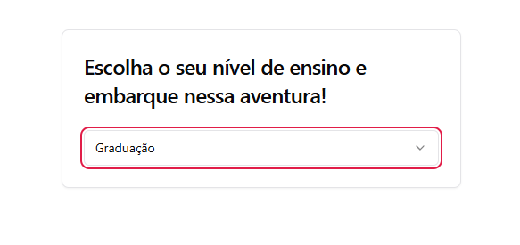
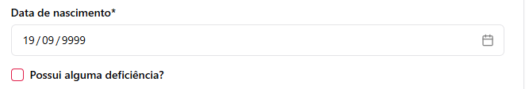

-Selecionar Nivel de ensino e retornar para tela principal - BUG

    *Reproduzir cenario
    -Selecionar nivel de ensino
    -Antes de selecinar o curso, retornar para tela principal
    -Selecionar o mesmo nivel de ensino que na primeira vez
    BUG - ELe seleciona mas não entende a seleção como ação.
    

-Input de CPF sem mascara na hora de inserir os dados

-Input de data de nascimento aceita data maior que ano atual

-Todos os usuarios são cadastrados com o mesmo usuario e senha.

----APOS REALIZAR LOGIN

Aba Financeiro não tem botão de voltar para o menu principal.
